# 制作赛博魔杖的Cyber_Vlog之NNoM篇
[TOC]
## 配置NNoM所需环境
### 下载VSCode
### 配置Anaconda
- 配置完成后，在随便一个盘建一个新文件夹，在VSCode里面打开这个文件夹，之后我们将在这个文件夹里面进行操作。//*我这里是在E盘建了一个Cyber_Wand_Try文件夹*
- 同时新建一个虚拟环境,之后我们将在这个环境里面进行操作。//*我这里建的是try虚拟环境*
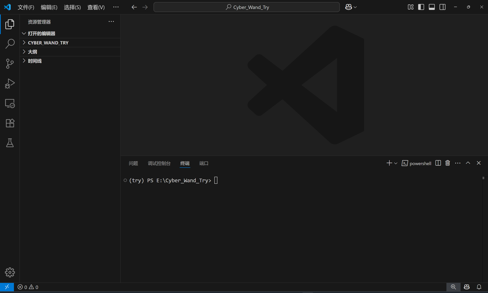
- 安装一些必要的库。
  在终端运行命令行，等待一会就下载完成了
  ```
  pip install pandas
  pip install scons
  ``` 

### 配置NNom
我这里给出我自己的方式，不是万能也未必最佳  
#### 安装tensorflow和keras库
- 根据NNoM文档，需要tensorflow<=2.14.1,同时我们需要用到keras
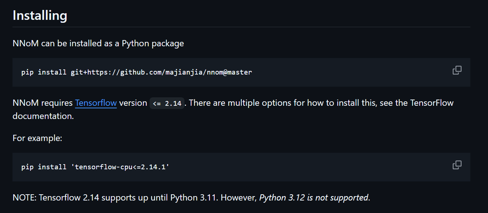

- 而根据Keras官方网站，tensorflow和keras的版本兼容如下
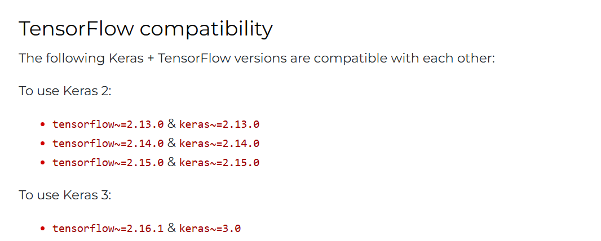
- 官方文档还告诉我，安装tensorflow版本=2.14.0会自动安装上keras版本=2.14
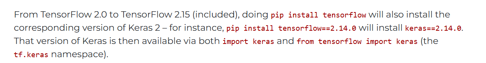
- 所以我选择
  **tensorflow版本=2.14.0，keras版本=2.14.0**
- 在终端运行命令行，等待一会就下载完成了
    ```
    pip install tensorflow==2.14.0
    ```
   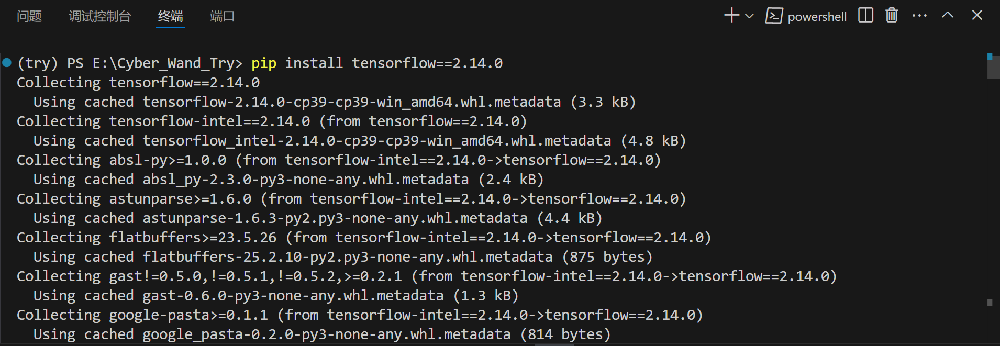
- 这样就成功安装了tensorflow和keras库
  
#### 安装NNoM库
- 官方给出的办法是
  
- 但是由于我的梯子不是很稳定，经常下不下来，所以我选择另一种方法
- 打开Github上的NNoM项目，在绿色的"Code"处点击，选择"Download ZIP"，将整个项目打包下载下来。然后再解压缩。//*我这里是下载在E盘*
  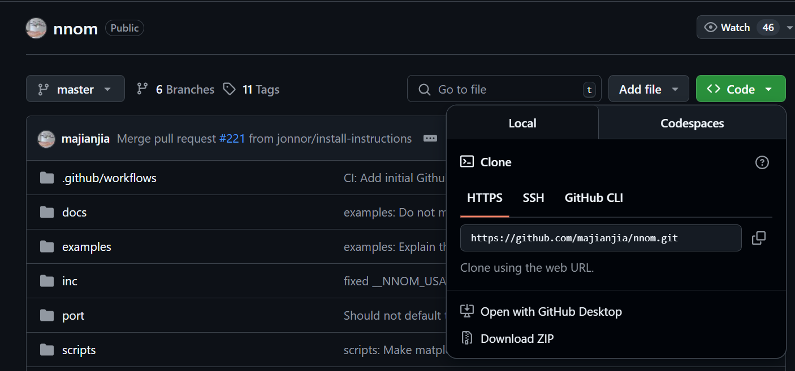
  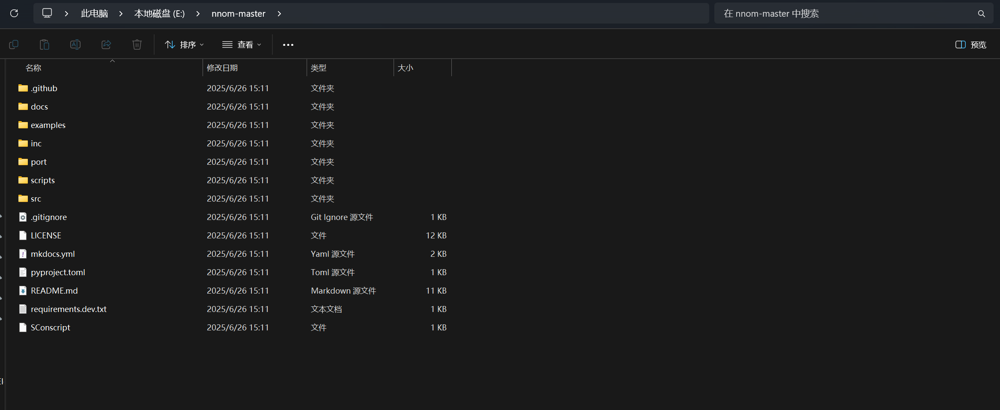
- 在终端运行命令行，等待一会就下载完成了
  **注意我这里的"E:\nnom-master"是这个文件夹的路径，请根据你的实际情况修改**。可以找到你的解压后的文件夹，右键，选择“复制文件地址”，在命令行处粘贴来进行替换。
  ```
  pip install "E:\nnom-master"
  ```
  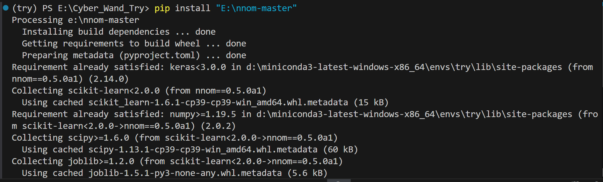
- 可以看到最后这里就是成功的信息
  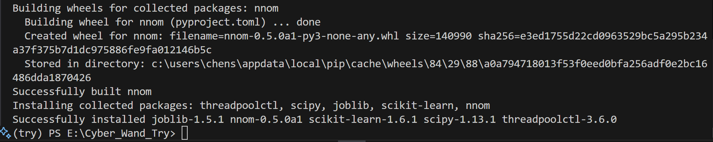

## 训练模型并用NNoM转成可以在MCU上运行的格式
### 采集数据
- stm32通过USB-TTL连接电脑，通过运行collect_data.py采集数据 
- 采集的数据以csv格式储存在对应文件夹下，每个文件夹下是一个种类的动作
- 只需要修改7-9行配置参数的代码就行，尤其需要注意“串口号PORT”和“路径DATA_DIR”
  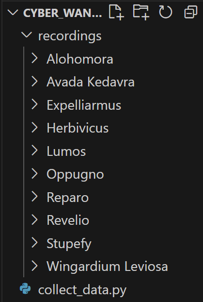
  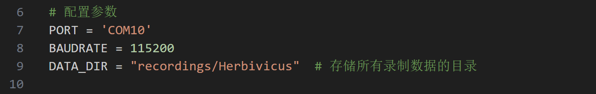

### 搭建模型并用采集到的数据训练
本部分我采用了模块化的代码编写，尽量封装了一些函数，虽然过程上稍显繁琐，但个人认为思路清晰更为重要
#### 数据加载函数 
- load_data.py
- 可以去掉后面的注释，打印基本信息，以及让数据可视化，了解一下情况
- 如果你需要让数据可视化，不要忘了先在环境中安装matpotlib库
  在终端运行命令行，等待一会就下载完成了
  ```
  pip install matplotlib
  ```
- 我的打印出来是这样的，当然，由于大家recordings里面数据不同，有差别也很正常
  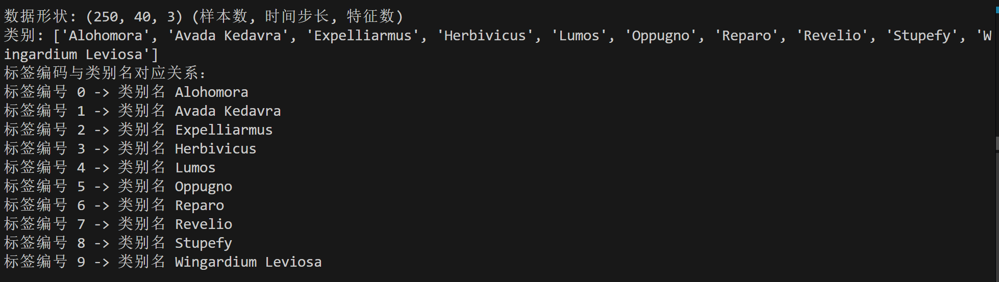
  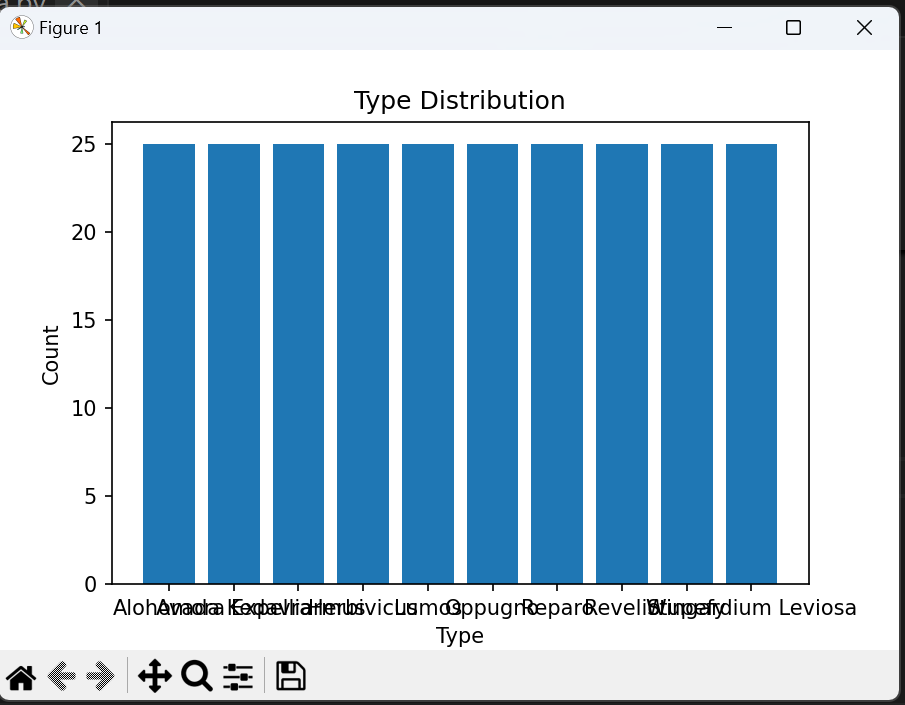
  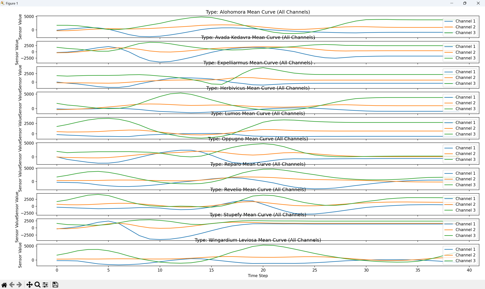
#### 划分训练集和测试集
- split_data.py
#### 搭建模型函数
- build_model.py
- 这是一个错误例子
  
  **1.不能写成sequential的形式  
  2.activation不能写在里面，要放在后面一行**
  这才是正确的
  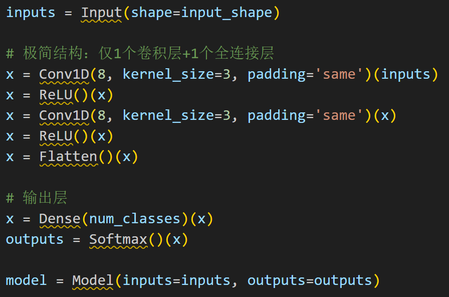
- 模型的层数和每层的类型大家可以自己调整
#### 训练模型函数
- train_model.py
- 学习率、早停等大家可以自己调整
#### 在主函数调用以上函数并转换为NNoM模型
- main.py
- 这里需要在load_data和split_data之间加上
  ```
  X /= 32768.0
  y = to_categorical(y, num_classes=10)
  ```
  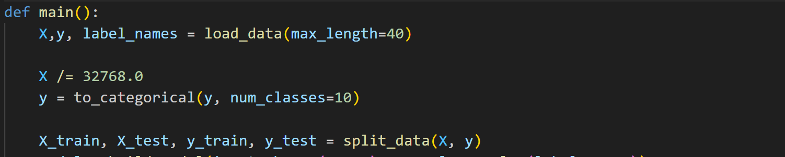
  具体原因之后会讲到。
- NNoM这个库其实主要就用在generate这一步，得到的weights.h就是模型可以移植的样子。
  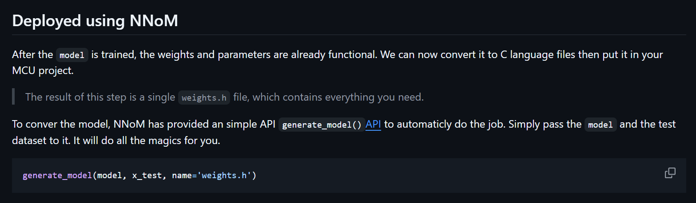
- 你唯一可以改动的地方就是"weights.h"这个名字了。至于format能不能改，我也不是很确定。
- 生成weight.h的同时还会生成一个.layer_q_list文本文件，里面存了每一层量化的参数。这里的一些数据之后有用。其实这一部分的数据weights.h文件里面也有，就在那一堆绿色数字下面一点。
  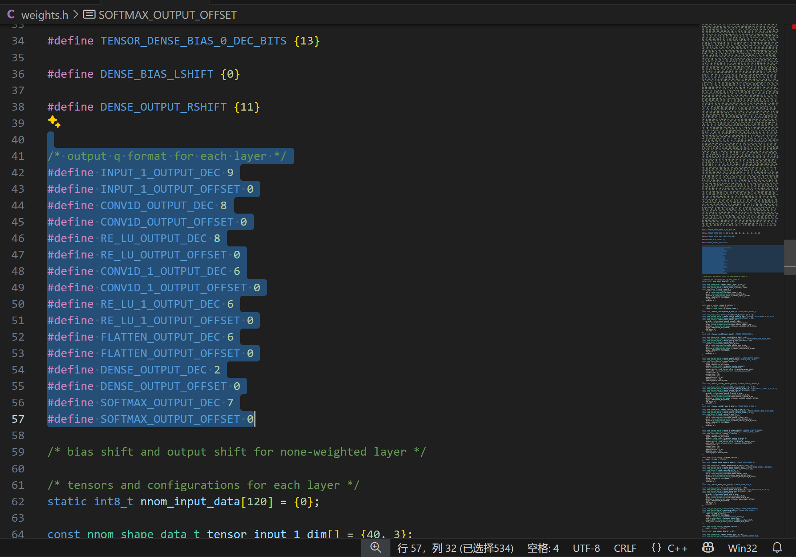
- 如果你运行了 main.py,但是出现报错
  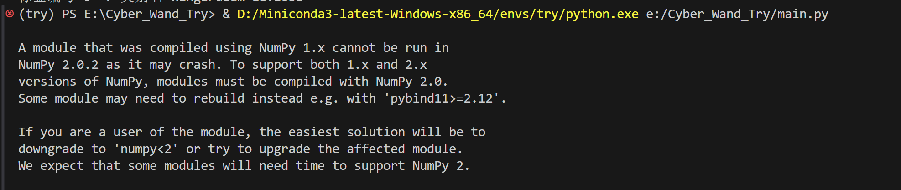
  **看起来是因为我的numpy版本过高不兼容导致的，要求使用numpy版本=1.x**
  所以我重装了numpy库
  在终端运行命令行，等待一会就下载完成了
  ```
  pip install "numpy<2" --upgrade
  ```
  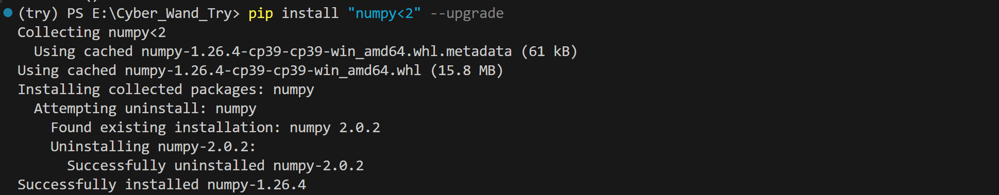
  这样就可以正常运行了
- 如果出现其他报错，注意你的数据格式，形状、类型等等都会导致报错
### 用NNoM在电脑上进行评估
由于keras模型向nnom模型转换可能存在精度下降的问题，NNoM的开发者提供了一个在电脑上评估模型的程序，可以先在电脑上确认转换后的模型仍然有效再向MCU移植。
以下用到的文档其实在NNoM的仓库内基本都能找到，我们要做的只是做一些修改。
#### 修改得到auto_test.py及其他有用的文件
- 在你下载的文件夹中找到examples -> auto_test ->  main.py，复制到你现在的工作区并重命名为 auto_test.py
  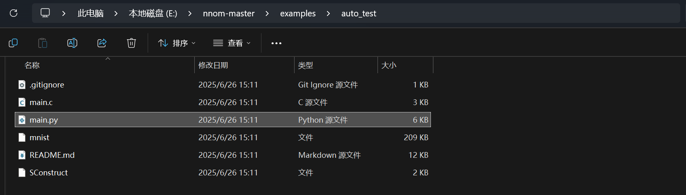
  我们将在这个示例代码上做修改，得到我们真正需要的评估代码auto_test.py 
- 我们先来分析一下这个代码现在的意思
  - 开头是作者的一些信息
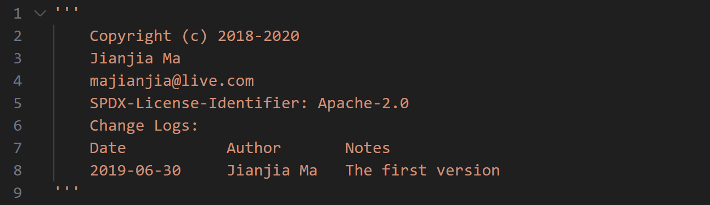
  - 然后导入一些库
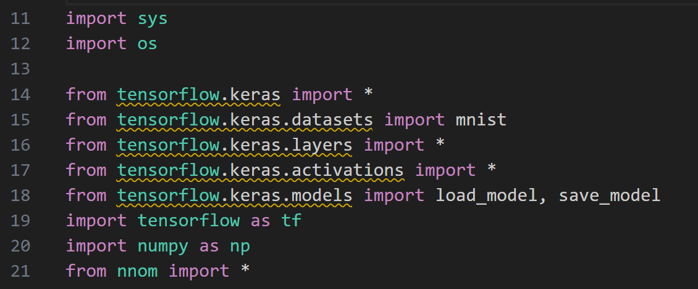
  - build_model函数用于搭建模型
  - train_model函数用于训练模型，这里用到了前面定义的save_dir，也就是模型存在哪里
  - 主函数前面的部分我们之前都做过了
    - 加载数据
    - 划分数据
    - 搭建模型
    - 训练模型
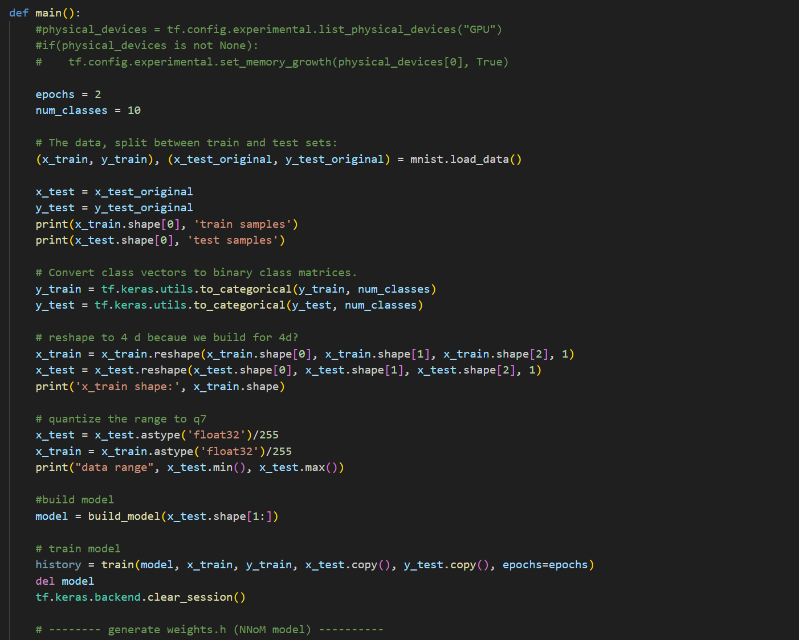
  但要注意几个点：
  1. **这里对y形状的转换**
   这个好像示例代码有错，我在用的时候发现后面的y_train和y_test都应该加上_original的后缀才对
   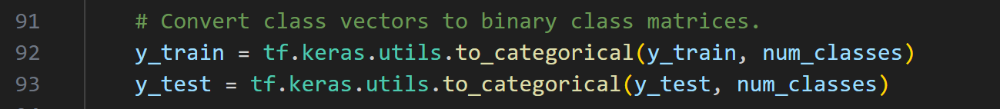
  2. **这里对X的量化**
  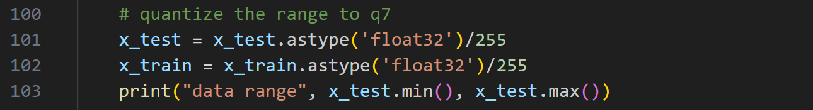
  这就是为什么之前说需要在load_data和split_data之间加上
    ```
    X /= 32768.0
    y = to_categorical(y, num_classes=10)
    ```
  **这两个是一定要做的不然会报错**。但是X的量化是除以2的多少次方要根据你自己输入的数据来决定，我目前的理解是让它量化完接近1就行。
  - 主函数后面的部分基本是我们之前没有做过的事情
    - 先加载模型
    - 然后用一部分数据去生成test_data.bin，这个在之后的部分有用
    - 用score来反映keras模型好坏
    - 生成nnom模型weights.h
  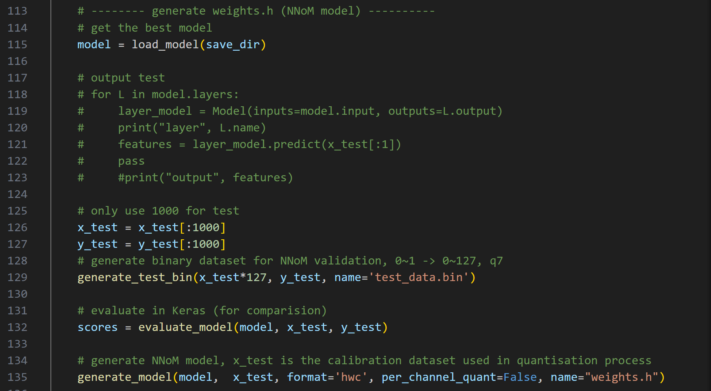
    - 简单来说，先是关于命令行简化的一些操作，为了方便后面使用，具体可以自己去查查，我也不是很懂
    - 然后自动运行一个exe文件
    - 算出一个acc用来评估nnom模型的准确度如何
  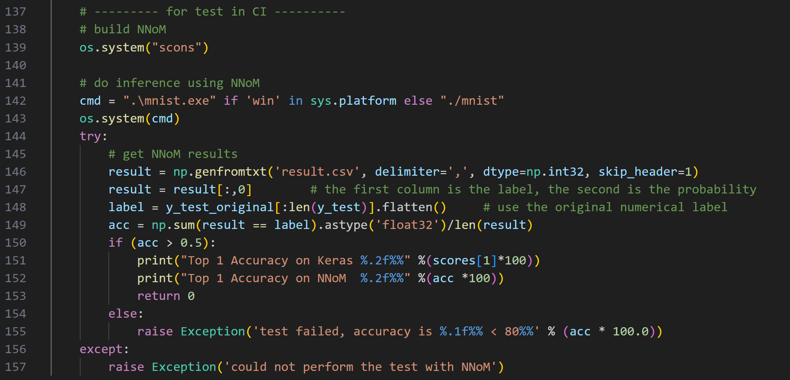
- 理解了原来的代码在干什么，现在我们开始修改
1. 删掉作者信息
2. 我选择不把训练模型的部分放进去，而是直接载入训练好的模型，这样就不会每次运行都重新训练模型了,同时也不再重新生成weights.h。但是我们要把载入数据的部分放进去，因为生成test_data.bin需要用到。
   - 当然，你也可以把我们之前写好的load_data,split_data，trian_model,build_model直接换进去，把训练模型的部分从main.py全部移到auto_test.py里，这样就是在auto_test.py里面训练模型并生成weights.h，每次运行都重新训练模型并生成.h文件
3. 我们的数据没有这么多，所以把only use 1000 for test去掉
4. 关于简化命令行的操作，我不知道怎么用示例代码中的那种，所以我让ai帮忙写了个Makefile文件
   - Makefile的内容如下
    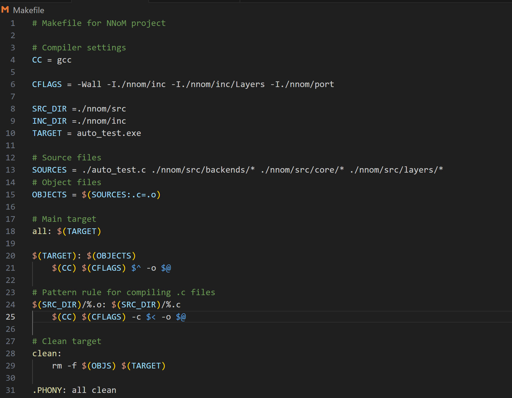 
   - 里面的具体内容跟你的项目结构有关系  //*我的文件结构如下图，nnom文件夹下的3个文件夹都是从Github上下载的那个文件夹里面复制过来的，Makefile直接放在Cyber_Wand_Try文件夹里面*
    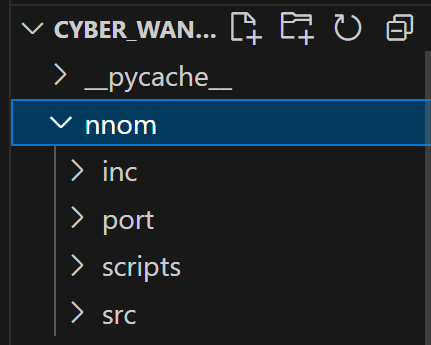
    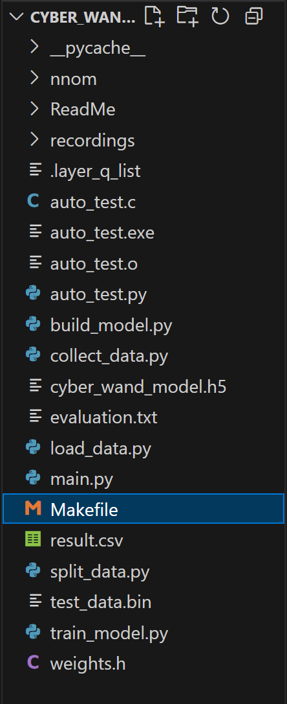
   - 在终端运行命令行
      ```
      mingw32-make all
      ```
      就可以得到auto_test.exe以及auto_test.o 
   - 而auto_test.c的来源跟auto_test.py一样，是把main.c复制过来重命名即可
5. 由于我们把名字改成了auto_test.exe，所以cmd那句也跟着改
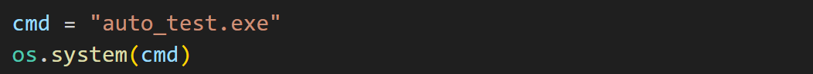
如果是linux用户要自己再修改一下
1. 需要的东西就都用了，接下来运行auto_test.py即可  
   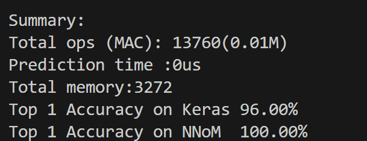
  这里就是keras模型和nnom模型各自的准确率啦，如果你比较满意的话，就可以把它移植到MCU上了

## 把NNoM模型移植到MCU上
### 添加需要的文件
#### 把需要的文件放到文件夹中
1. 在项目文件夹里面新建一个nnom文件夹
2. 把需要的文件复制进来
   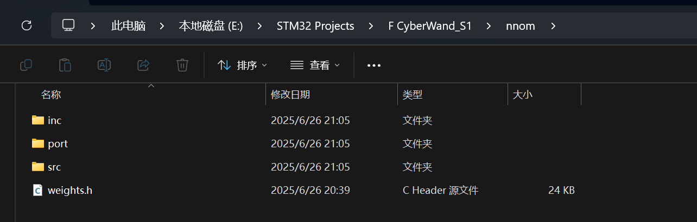
   **我们只需要Github上下载文件夹里面inc，port，src这三个文件夹，以及之前生成的weights.h模型文件**
#### 把需要的文件从文件夹添加到项目
1. 在Keil 5 MDK打开原来项目，在Target下add group，命名为nnom
2. 把上一步那个nnom文件夹里的所有文件都add进来
3. 添加它们的路径，**有文件的每一级都要添加**
   
### 在主函数中调用
#### 修改nnom_port.h文件
把第20行解除注释，这样可以使用静态内存
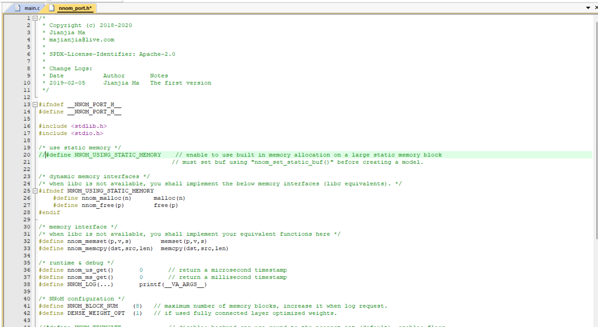
#### 修改main.c
根据官方文档
 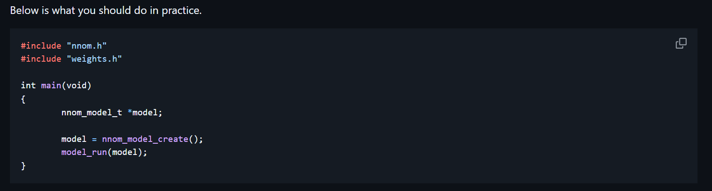
我们目前知道的以及该做的事情有
- 需要添加头文件
  ```
  #include <math.h>   //量化要用到阶乘pow函数，这个之后会知道
  #include "nnom.h"
  #include "weights.h"
  ```
- 定义model变量
  ```
  nnom_model_t *model;
  ```
- 给model赋值
  ```
  model = nnom_model_create();
  ```
- 在需要使用model的时候调用
  ```
  model_run(model);
  ```

那么除此之外还有那些事情要做呢？
官方文档还告诉我们：
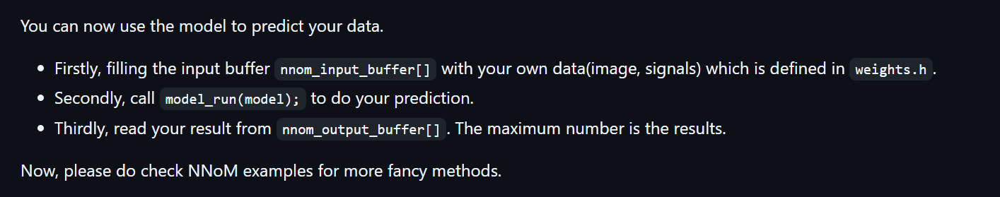
现在我们知道模型的输入和输出是存在哪里的了，那就对原有的输入和输出部分做相应的修改吧
- 把读到的数据存到nnom_input_buffer[]里
1.  我们先定义一个数组来存MPU6050的数据
  ```
  float mpu6050_acc[40][3] = {0} ;    
  ```
2. 在主函数中，按下按钮开始录制时，本来要向串口输出的MPU6050数据现在要存在这里。那么我们就在有串口输出数据的部分都加上
  ```
  mpu6050_acc[motion_index][0] = AccX / 32768.0;  //32768.0就是前面让它接近1的那个量化值
  mpu6050_acc[motion_index][1] = AccY / 32768.0;
  mpu6050_acc[motion_index][2] = AccZ / 32768.0;
  ```
  其中motion_index表示现在是一个样本的第几组数据了,记得在前面定义
  ```
  uint8_t motion_index
  ```
3. 定义一个函数nnom_feed_input()
  ```
  void nnom_feed_input(void)
  {
    uint8_t i = 0;
    double scale = pow(2,INPUT_1_OUTPUT_DEC);   //这个是跟量化有关的，INPUT_1_OUTPUT_DEC在.layer_q_list里面可以找到，weights.h里面也有
    for(i = 0;i < 40; i++)
    {
      nnom_input_data[i*3] = (int8_t)round(mpu6050_acc[i][0]*scale);
      nnom_input_data[i*3+1] = (int8_t)round(mpu6050_acc[i][1]*scale);
      nnom_input_data[i*3+2] = (int8_t)round(mpu6050_acc[i][2]*scale);
    }
  }
  ```
调用这个函数就能把数据存到nnom_input_data[]里了
这里的40跟训练模型用的样本长度有关
- 从nnom_output_buffer[]读出结果并从串口输出
  定义一个函数nnom_get_output
  ```
  void nnom_get_output(void)
  {
    model_run(model);
    uint8_t i = 0;
    for(i = 0;i < 10;i++)
    {
      float output = (float)nnom_output_data[i] /127 *100;    //除以127跟auto_test.py里面的*127有关系
      printf("output[%d]=%.2f%%\n",i,output);   //以百分数格式输出
    } 
  }
  ```
  调用这个函数就能把结果输出在串口了
  这里的10跟总共要区分的种类有关

- 此外我们还要做一些定义，至于为什么要做这些定义我并没有找到说明。我个人的理解是开辟一个静态内存缓冲区，大小为8KB，这样既能满足轻量级神经网络的需求，又能保证确定性较高的内存使用(8*1024字节)
  ```
  #ifdef NNOM_USING_STATIC_MEMORY   //写在最前面
  static uint8_t nnom_buffer[8*1024];
  #endif

  #ifdef NNOM_USING_STATIC_MEMORY   //写在主函数里
  nnom_set_static_buf(nnom_buffer, sizeof(nnom_buffer));
  #endif
  ```
  通过实践可以知道的是，**一定要把它们放在#ifdef和#endif之间**，不然就会出现问题
- 注意每次预测结束后，一些变量要清零
## 到此为止圆满结束！撒花！
2025.06.28 1：38，北京 清华大学 紫荆学生公寓4号楼